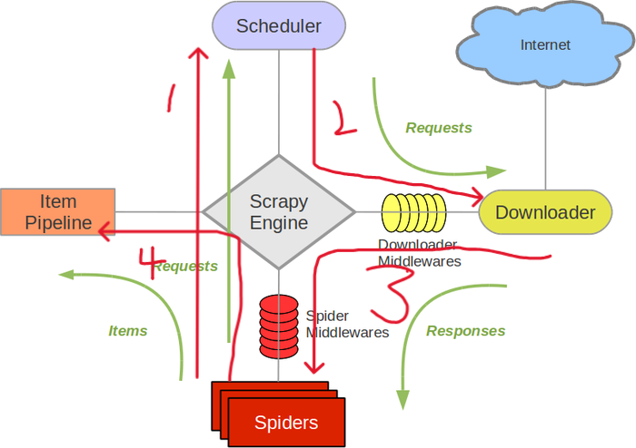

## Scrapy 框架介绍

```
Scrapy是用纯Python实现一个为了爬取网站数据、提取结构性数据而编写的应用框架，用途非常广泛。
Scrapy框架：用户只需要定制开发几个模块就可以轻松的实现一个爬虫，用来抓取网页内容以及各种图片，非常之方便。
Scrapy 使用了Twisted(其主要对手是Tornado)多线程异步网络框架来处理网络通讯，可以加快我们的下载速度，不用自己去实现异步框架，并且包含了各种中间件接口，可以灵活的完成各种需求。
```


#### Scrapy架构图 




```python
Scrapy主要包括了以下组件：
	Scrapy Engine(引擎): 
        负责Spider、ItemPipeline、Downloader、Scheduler中间的通讯，信号、数据传递等。

	Scheduler(调度器): 
        它负责接受`引擎`发送过来的Request请求，并按照一定的方式进行整理排列，入队，当`引擎`需要时，交还给`引擎`。

	Downloader（下载器）：
    	负责下载`Scrapy Engine(引擎)`发送的所有Requests请求，并将其获取到的Responses交还给`Scrapy Engine(引擎)`，由`引擎`交给`Spider`来处理，

	Spider（爬虫）：
    	它负责处理所有Responses,从中分析提取数据，获取Item字段需要的数据，并将需要跟进的URL提交给`引擎`，再次进入`Scheduler(调度器)`，

	Item Pipeline(管道)：
    	它负责处理`Spider`中获取到的Item，并进行后期处理（详细分析、过滤、存储等）的地方.

	Downloader Middlewares（下载中间件）：
		你可以当作是一个可以自定义扩展下载功能的组件。

	Spider Middlewares（Spider中间件）：
    	你可以理解为是一个可以自定扩展和操作`引擎`和`Spider`中间`通信`的功能组件（比如进入`Spider`的Responses和从`Spider`出去的Requests）
        
```


### 安装Scrapy

```python
Scrapy的安装介绍
	Scrapy框架官方网址：http://doc.scrapy.org/en/latest
	Scrapy中文维护站点：http://scrapy-chs.readthedocs.io/zh_CN/latest/index.html
	
安装方式:   
    pip install scrapy -i https://pypi.douban.com/simple
    

```


### 使用Scrapy

#### 使用爬虫可以遵循以下步骤：

1. 创建一个Scrapy项目
2. 定义提取的Item
3. 编写爬取网站的 spider 并提取 Item
4. 编写 Item Pipeline 来存储提取到的Item(即数据)


#### 1. 新建项目(scrapy startproject)

##### 创建一个新的Scrapy项目来爬取 https://www.meijutt.tv/new100.html 中的数据，使用以下命令：

```python
scrapy startproject meiju
```

##### 创建爬虫程序

```python
cd meiju
scrapy genspider meijuSpider meijutt.tv

其中：
	meijuSpider为爬虫文件名
	meijutt.com为爬取网址的域名
```

创建Scrapy工程后, 会自动创建多个文件，下面来简单介绍一下各个主要文件的作用：

```python
scrapy.cfg：
	项目的配置信息，主要为Scrapy命令行工具提供一个基础的配置信息。（真正爬虫相关的配置信息在settings.py文件中）
items.py：
	设置数据存储模板，用于结构化数据，如：Django的Model
pipelines：
	数据处理行为，如：一般结构化的数据持久化
settings.py：
	配置文件，如：递归的层数、并发数，延迟下载等
spiders：
	爬虫目录，如：创建文件，编写爬虫规则
    
注意：一般创建爬虫文件时，以网站域名命名
```

#### 2. 定义Item

​	Item是保存爬取到的数据的容器；其使用方法和python字典类似，虽然我们可以在Scrapy中直接使用dict，但是 Item提供了额外保护机制来避免拼写错误导致的未定义字段错误；

​	类似ORM中的Model定义字段，我们可以通过scrapy.Item 类来定义要爬取的字段。

```python
import scrapy

class MeijuItem(scrapy.Item):
    name = scrapy.Field()
```

#### 3. 编写爬虫

```python
# -*- coding: utf-8 -*-
import scrapy
from lxml import etree
from meiju.items import MeijuItem

class MeijuspiderSpider(scrapy.Spider):
    # 爬虫名
    name = 'meijuSpider'
    # 被允许的域名
    allowed_domains = ['meijutt.tv']
    # 起始爬取的url
    start_urls = ['http://www.meijutt.tv/new100.html']

    # 数据处理
    def parse(self, response):
        # response响应对象
        # xpath
        mytree = etree.HTML(response.text)
        movie_list = mytree.xpath('//ul[@class="top-list  fn-clear"]/li')

        for movie in movie_list:
            name = movie.xpath('./h5/a/text()')

            # 创建item(类字典对象)
            item = MeijuItem()
            item['name'] = name
            yield item

```

##### 启用一个Item Pipeline组件

为了启用Item Pipeline组件，必须将它的类添加到 settings.py文件ITEM_PIPELINES 配置修改settings.py，并设置优先级，分配给每个类的整型值，确定了他们运行的顺序，item按数字从低到高的顺序，通过pipeline，通常将这些数字定义在0-1000范围内（0-1000随意设置，数值越低，组件的优先级越高）

```python
ITEM_PIPELINES = {
   'meiju.pipelines.MeijuPipeline': 300,
}
```

##### 设置UA

在setting.py中设置USER_AGENT的值

```python
USER_AGENT = 'Mozilla/5.0 (Windows NT 6.1; Win64; x64) AppleWebKit/537.36 (KHTML, like Gecko) Chrome/66.0.3359.181 Safari/537.36'

```

#### 4. 编写 Pipeline 来存储提取到的Item(即数据)

```python
class SomethingPipeline(object):
    def __init__(self):    
        # 可选实现，做参数初始化等
        
	def process_item(self, item, spider):
        # item (Item 对象) – 被爬取的item
        # spider (Spider 对象) – 爬取该item的spider
        # 这个方法必须实现，每个item pipeline组件都需要调用该方法，
        # 这个方法必须返回一个 Item 对象，被丢弃的item将不会被之后的pipeline组件所处理。
        return item

    def open_spider(self, spider):
        # spider (Spider 对象) – 被开启的spider
        # 可选实现，当spider被开启时，这个方法被调用。

    def close_spider(self, spider):
        # spider (Spider 对象) – 被关闭的spider
        # 可选实现，当spider被关闭时，这个方法被调用
    
```
##### 运行爬虫：

```python
scrapy crawl meijuSpider

# nolog模式
scrapy crawl meijuSpider --nolog  
```

scrapy保存信息的最简单的方法主要有这几种，-o 输出指定格式的文件，命令如下：

```python
scrapy crawl meijuSpider -o meiju.json
scrapy crawl meijuSpider -o meiju.csv
scrapy crawl meijuSpider -o meiju.xml
```


##### 练习： Scrapy爬取新浪新闻存入数据库 http://roll.news.sina.com.cn/news/gnxw/gdxw1/index_1.shtml 
